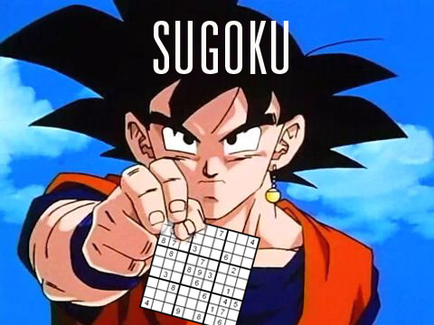

# SuGoku

## Workshop
Il workshop mira a far conoscere le basi di Go, utilizzeremo un risolutore di sudoku per farlo.

## Comandi
`go run main.go samples/<nomesample>`

lancia il programma con il file di esempio specificato.

Viene mostrato un menu che chiede quale algoritmo utilizzare per risolvere il sudoku.

Una volta scelto, il programma mostra il sudoku da completare ed il suo risultato, assieme al tempo di esecuzione.

## Algoritmi
 - Abbiamo implementato:
   - Un simple solver (nel branch simple_solver) che controlla per ogni cella quali valori sono ammessi e li inserisce.  
     Il simple solver non riesce a risolvere sudoku di difficoltà elevata.
     NOTA: abbiamo utilizzato il GOTO di Go.
   - Un backtracking solver (nel branch backtracking_solver) che utilizza la tecnica del backtracking per risolvere il sudoku.  
     Il backtracking prova a inserire un valore in una cella e controlla se il sudoku è valido, se non lo è prova con un altro valore.  
     Il backtracking solver riesce a risolvere sudoku di difficoltà elevata.
 - Vogliamo provare ad implementare:
   - Un PencilMark solver (nel branch pencilmark_solver) che utilizza la tecnica dei pencil mark per risolvere il sudoku.  
     I pencil mark sono dei numeri che vengono inseriti nelle celle che possono contenere quel numero.
     Probabilmente il pencil mark solver non riuscirà a risolvere un sudoku se ci si trova nel caso in cui nessuna cella ha una sola possibile soluzione.
     NOTA: Provare ad utilizzare canali e waiting groups per parallelizzare il solver.
